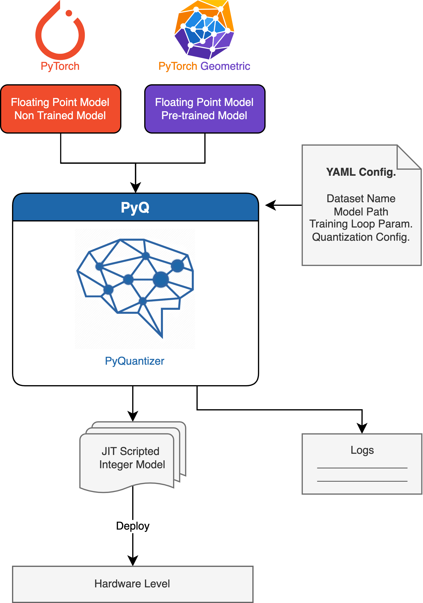
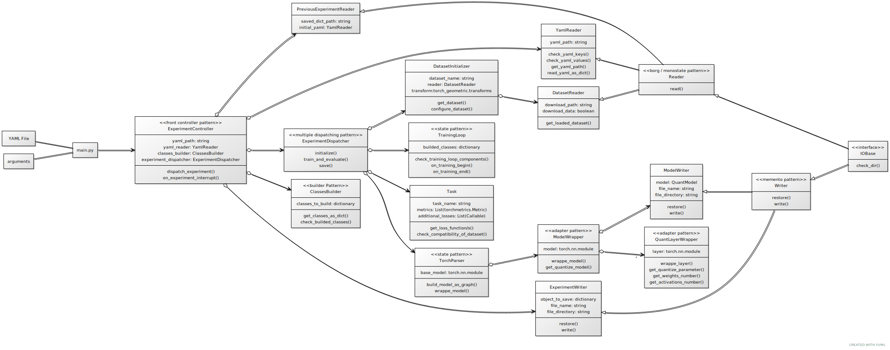
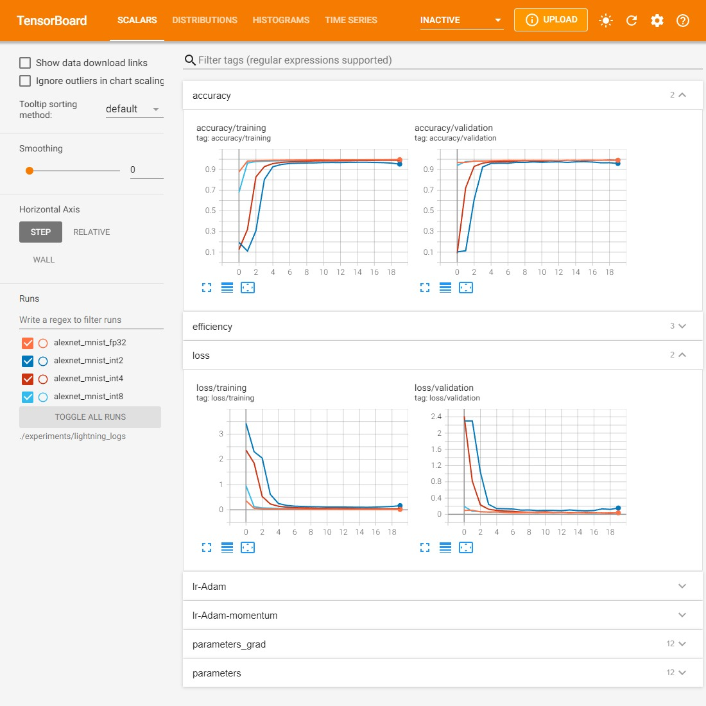
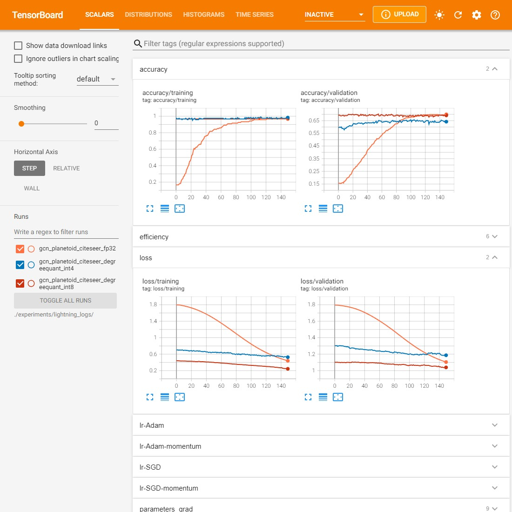

<div align="center">


<h1> PyQ (Alpha Version)


_________________________
</div>

`PyQ` is a deep learning quantization software suite that allows deep learning inference to go scale and speed. 
With `PyQ` you can:

1. Wrap all types of layers for any PyTorch-based model.
2. Quantize the wrapped layers, activation, and message passing using [predefine wrappers](./scripts/plot_gradient.ipynb), or define your quantization technique.
3. Train, evaluate, and monitor the quantized model performance, parameter and its gradients
4. Obtain a jit script model that can be deployed using other frameworks


<!-- <div align="center">

$`\mathbf{h}_{v}^{(k)}=f_{\theta}^{(k)}\left(\mathbf{h}_{v}^{(k-1)}, \bigoplus_{u \in \mathcal{N}(v)} g_{\theta}^{(k)}\left(\mathbf{h}_{v}^{(k-1)}, \mathbf{h}_{u}^{(k-1)}, \mathbf{e}_{v, u}\right)\right)`$


$`\mathbf{h}_{v}^{(k)}=\overbrace{f_{\theta}^{(k)}\left(\mathbf{h}_{v}^{(k-1)}, \underbrace{\bigoplus_{u \in \mathcal{N}(v)} \overbrace{g_{\theta}^{(k)}\left(\mathbf{h}_{v}^{(k-1)}, \mathbf{h}_{u}^{(k-1)}, \mathbf{e}_{v, u}\right)}^{\text{Matrix Multiplication with }\theta_{g} \texttt{(W,A)}}}_{\text{Message Passing from Neighbours \texttt{(P)}}}\right)}^{\text{Matrix Multiplication with }\theta_{f}  \texttt{(W,A)}}`$

</div> -->


# Installation
```bash
# 1. Create new environment for the the project:
conda create -n pyq python=3.9
# 2. Activate the new environment:
conda activate pyq
# 3. Install cudatoolkit 10.2 and PyTorch dependencies:
conda install pytorch torchvision torchaudio cudatoolkit=11.3 -c pytorch
# 4. Install PyTorch Geometric, and it's dependencies:
pip install torch-scatter torch-sparse torch-cluster torch-spline-conv torch-geometric -f https://data.pyg.org/whl/torch-1.12.0+cu113.html
# 5. Clone PyQ repository:
git clone https://gitlab.cs.univie.ac.at/samirm97cs/pyq.git && cd pyq
# 5. Export the PYTHONPATH for the repository:
echo "export PYTHONPATH="`pwd`/:\${PYTHONPATH}"" >> ~/.bashrc && source ~/.bashrc
```

# Overview

An overview of `PyQ` from the user perspective where the framework accepts computer vision PyTorch models or PyTorch Geometric model and the configuration file to quantize the whole model.

<div align="center">


</div>

###### YAML File Structure:
```yaml
dataset:
  class_name: DataInitializer
  dataset_name: # Category or name of the dataset for example `Planetoid` or `CIFAR10`
  name: # Additinal name for the dataset for example `Cora`

dataloader:
  ... Arguments for the dataloaders for both training and validation 
  batch_size: 8

model:
  # Use one from the predefined model in `PyQ` like: AlexNet, ResNet18, MobileNetV2, GCN, GAT, or GIN
  # or use the following to load your own model
  class_name: ModelReader
  directory: ".../path_that_contains_your_own_model/name_of_model.pth"

# Layers (default layers or message passing layes), and activations wrappers
# `TorchModuleWrapper` is wrapper that just wrap the object without add anything
layer_wrapper:
  class_name: $TorchModuleWrapper
activation_wrapper:
  class_name: $TorchModuleWrapper

parser:
  class_name: TorchModelParser
  callable_object: /layer_wrapper
  callable_object_for_nonparametric: /activation_wrapper
  skip_parsing: # Boolean to determine to wrapp model layers or not
  remove_layers_bias: # Remove biases from the layers, (support fusion instead of removing them only)
  delete_layer_by_type: # List of types of layers to replace with identity layer
    - class_name: $BatchNorm2d
    ....
  skip_layer_by_type:   # List of types of layers to avoid wrapping them
    - class_name: $BatchNorm2d
    ....
  skip_layer_by_regex:   # List of regular expression to match layers to avoid wrapping them
    - "^conv_layer_1.0$"
    ....

task:
  class_name: # `ImageTask` or `GraphTask`
  task_name: classification # For now the only provided task name is classification
  model: /model
  dataset: /dataset

# Additional arguments for training
losses:
  - class_name: CrossEntropyLoss
metrics:
  - class_name: Accuracy
  - class_name: AUROC
training_loop:
  class_name: $TrainingLoop
  epoch: 60
  callbacks:
    - class_name: LearningRateMonitor
      logging_interval: epoch
      log_momentum: True
  number_of_gpus: 1

optimizer:
  class_name: $Adam
  lr: 0.001

scheduler:
  class_name: $ConstantLR
  factor: 0.5
```

###### `PyQ` Arguments
- `seed`: Random seed value for deterministic behavior.
- `gpu`: List of target GPUs to be used by the experiment, for example: 0,1,2
- `config`: YAML file that hold the configuration.
- `ckpt`: Path for the checkpoint to restore and resume the experiment from it.
- `logs_dir`: Optional path to write the logs into it.


###### Contribution guidelines
If you want to contribute to `PyQ` , be sure to review the [contribution guidelines](contributing.md).

# Usage
1. Run two examples:
```bash
python main.py --config examples/vision/cifar10_resnet18.yaml
python main.py --config examples/vision/imagenet200_mobilenetv2.yaml
```
2. start Tensorboard on the localhost:
```bash
tensorboard --host 0.0.0.0 --logdir=./experiments/
```

# Project Structure
```bash
├── examples
│   ├── graph
│   │   ├── citeseer_gcn.yaml
│   │   ├── ... Graph classification examples ...
│   │   └── reddit_binary_gin_degree_quant.yaml
│   └── vision
│       ├── cifar10_resnet18.yaml
│       ├── ... Computer vision example ...
│       └── mnist_alexnet_quant.yaml
├── pyq
│   ├── __init__.py
│   ├── core
│   │   ├── __init__.py
│   │   ├── parser.py
│   │   ├── quantization
│   │   │   ├── __init__.py
│   │   │   ├── communication_wrapper.py
│   │   │   ├── functional.py
│   │   │   ├── initializer.py
│   │   │   ├── observer.py
│   │   │   ├── supported_operations.py
│   │   │   └── wrapper.py
│   │   └── wrapper.py
│   ├── datasets
│   │   ├── __init__.py
│   │   ├── initializer.py
│   │   ├── splitter.py
│   │   └── transforms.py
│   ├── experiment
│   │   ├── __init__.py
│   │   ├── classes_builder.py
│   │   ├── controller.py
│   │   ├── default_values.py
│   │   └── function_builder.py
│   ├── io
│   │   ├── __init__.py
│   │   ├── base.py
│   │   ├── experiment.py
│   │   ├── model.py
│   │   └── yaml_files.py
│   ├── models
│   │   ├── __init__.py
│   │   ├── editor.py
│   │   ├── graph
│   │   │   ├── __init__.py
│   │   │   ├── basic_gnn.py
│   │   │   ├── gat.py
│   │   │   ├── gcn.py
│   │   │   └── gin.py
│   │   ├── vision
│   │   │   ├── __init__.py
│   │   │   ├── alexnet.py
│   │   │   ├── mobilenetv2.py
│   │   │   ├── resnet.py
│   │   │   └── vgg.py
│   │   └── wrapper.py
│   ├── paths.py
│   ├── training
│   │   ├── __init__.py
│   │   ├── dispatcher.py
│   │   ├── loop.py
│   │   └── task.py
│   ├── utils.py
│   └── version.py
├── requirements.txt
└── main.py
```

# Initiale UML Diagram
<div align="center">

</div>

# Output

<div align="center">


</div>


# License
Copyright © 2022, Samir Mousatafa

Contact address: [samir.moustafa@univie.ac.at](samir.moustafa@univie.ac.at)
